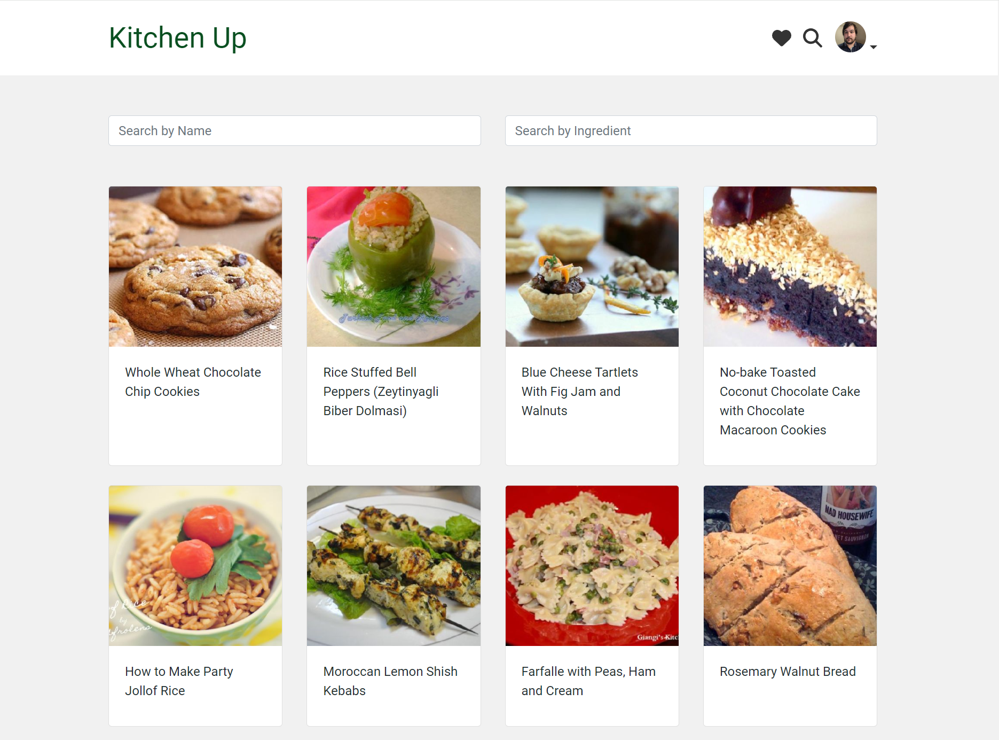
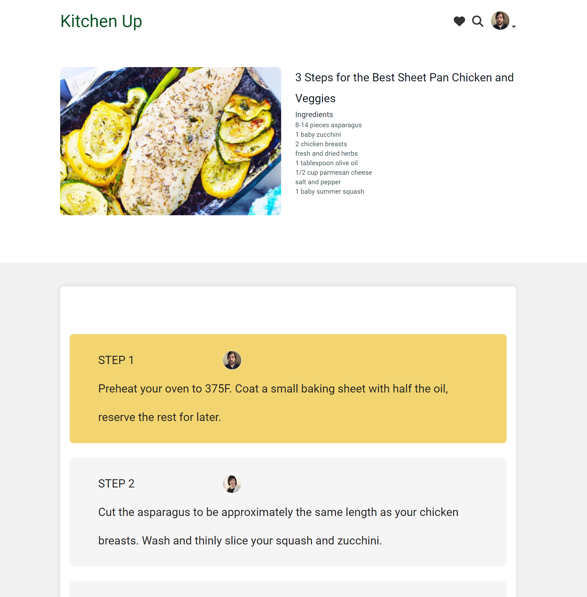
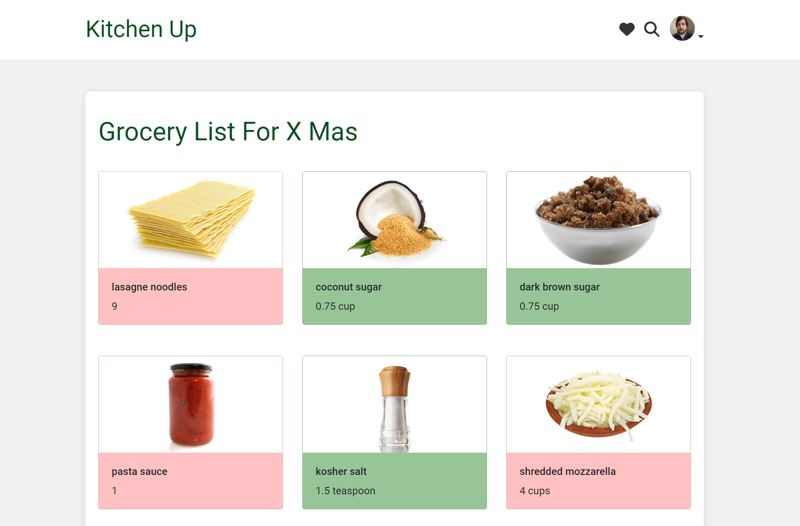

# Kitchen UP

It's a place where you can share and find recipes, and get inspired for your next cooking adventure. Imagine finding great meal ideas and easily inviting your friends to join in. With KitchenUp, cooking is not just a task, but a shared experience that brings joy back into your kitchen!

Kitchen Up is React-based application with express server on the backend. We utilized Sendgrip and Spoonacular API for some of the functionality. The best feature is using web sockets for bi-directional communication for cooking sessions.

## Collaborators

Dariia L - [Dariia GitHub](https://github.com/DariiaLeliukh)

Frankie T - [Frankie GitHub](https://github.com/ftennisco)

Marina I - [Marina GitHub](https://github.com/marinaivanovadev)

Rauber SN - [Rauber GitHub](https://github.com/raubersn)

## Final Product
Homepage gives a choice of random recipes to choose from as well as search fields to find the specific item or search by ingredient

You can invite your friends to join a cooking session with you in real time.
Cooking session gives interactive way for people to ejoy cooking together even being far away. In this interactive session, you can follow everyone’s progress as you cook together and share the experience.

You can see the grocery list needed for the recipes in the chosen recipe list. You can mark items as purchased with a simple click and it will highlight the item in green.

There is much more to the app so I invite you to test it!

## Pre-Configuration

### Install yarn 
Install yarn if you don't have one

Run `npm install yarn -g` to install yarn globally

### Database

Run psql and create database final with `CREATE DATABASE final`. Connect to the database `\c final`

## Project Setup

### Front-end

(In a separate tab)
enter the front-end folder
`cd react-front-end`
and install yarn
`yarn`

### Back-end

Enter the back-end folder
`cd ../express-back-end`
and install yarn
`yarn`

### Set database connection variables

Copy and rename `.env.example` to `.env`

Set the environment variables accordingly.

### Reset db

While in back-end folder, reset database
`yarn db:reset`

### Set the Twilio SendGrid API key

`Kitchen up` uses the SendGrid API to send invitations to cooking sessions by e-mail. In order to use the API, you need to:

- Register for an [SendGrid account](https://signup.sendgrid.com/)
- Configure the `SENDGRID_API_KEY` environment variable in the `.env` file with your [SendGrid api key](https://app.sendgrid.com/guide/integrate/langs/nodejs).

### Set the spoonacular API key

`Kitchen UP` uses the spoonacular API to fetch recipes and ingredients information. In order to use the API, you need to:

- Register for an [spoonacular account](https://spoonacular.com/food-api/console)
- Configure the `RECIPE_API_KEY` environment variable in the `.env` file with your [spoonacular api key](https://spoonacular.com/food-api/console#Profile).

`Kitchen UP` uses the SendGrid API to send emails with notifications. In order to use the API, you need to:

- Register for an [sendgrid account](https://sendgrid.com/en-us/solutions/email-api)
- Configure the `SENDGRID_API_KEY` environment variable in the `.env` file 

### Launch Kitchen Up (back-end and front-end)

`yarn go` from the back-end folder
